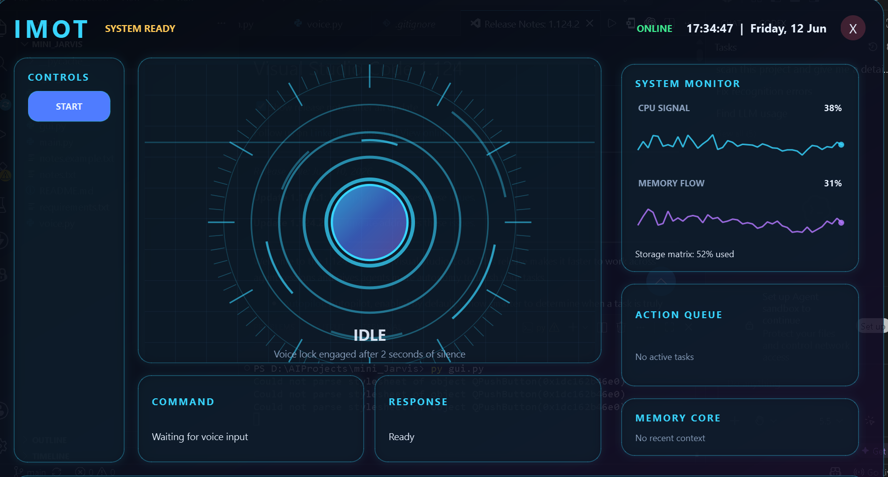
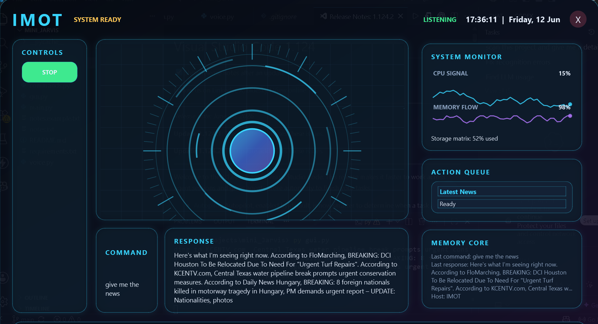

# IMOT Mini Jarvis

IMOT is a Windows desktop AI voice assistant built with Python. It combines a custom PySide6 HUD, speech recognition, text-to-speech, local AI planning through Ollama/Llama 3, and desktop automation.

## Features

- Voice and typed command input
- Text-to-speech responses using Windows SAPI with a pyttsx3 fallback
- Local Llama 3 chat and command planning through Ollama
- Open and close Windows apps such as Chrome, Notepad, Calculator, VS Code, Paint, Explorer, Discord, Spotify, Word, Excel, and PowerPoint
- Open websites and run Google or YouTube searches
- Fetch latest news from Google News RSS
- Fetch weather from wttr.in
- Tell the current time and date
- Save and read local notes
- Type text into the active window or open Notepad and write text automatically
- Short-term memory for recent commands and responses
- Animated PySide6 interface with listening, thinking, speaking, and idle states

## Requirements

- Windows
- Python 3.10+
- A working microphone for voice input
- Ollama installed locally
- The Llama 3 model pulled in Ollama

## Setup

Install Python dependencies:

```powershell
pip install -r requirements.txt
```

Install Ollama from the official website:

```text
https://ollama.com
```

Pull the local model used by the app:

```powershell
ollama pull llama3
```

Run the assistant:

```powershell
python main.py
```

## Notes And Privacy

Runtime notes are stored in `notes.txt`. That file is ignored by Git because it may contain personal information. Use `notes.example.txt` as the public example format.

This project does not require stored API keys. It uses local Ollama for AI responses, Google News RSS for news, and wttr.in for weather.

## Project Structure

- `main.py` starts the application.
- `gui.py` contains the PySide6 interface, animation, threading, memory display, and command loop.
- `brain.py` turns user text into assistant actions using regex shortcuts and Ollama.
- `commands.py` executes app, website, search, news, weather, note, and typing actions.
- `voice.py` handles speech recognition and text-to-speech.
## Screenshot



